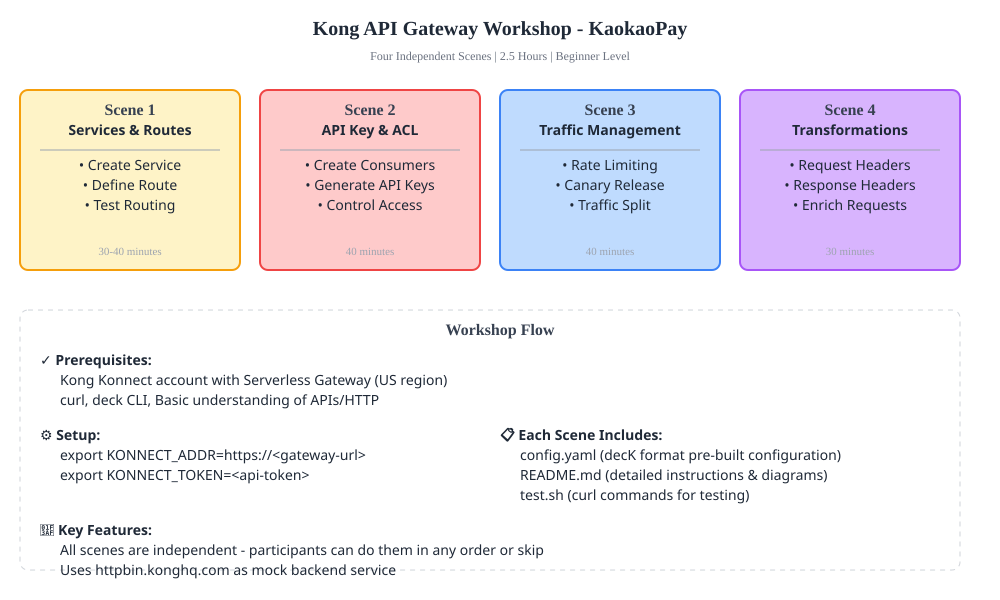

# Kong API Gateway Workshop - KaokaoPay

A hands-on workshop for developers and platform engineers to learn core Kong API Gateway use cases using Kong Konnect Serverless Gateway.

**Duration:** 2.5 hours | **Level:** Beginner | **Audience:** Developers & Platform Engineers

---

## Overview

This workshop covers essential Kong API Gateway capabilities through four independent, practical scenarios. Each scene is self-contained and demonstrates real-world use cases you'll encounter when managing APIs at scale.

### Quick Visual Overview


## Workshop Structure

Four independent scenes, each ~30-40 minutes including setup and testing:

1. **Scene 1: Services & Routes** - API gateway fundamentals
2. **Scene 2: API Key & ACL** - Consumer Groups and access control
3. **Scene 3: Traffic Management** - Rate limiting and canary releases
4. **Scene 4: Request Transformations** - Request/response modification

---

## Prerequisites

- Kong Konnect account (free tier available)
- Kong Konnect Serverless Gateway deployed in US region
- `curl` installed (for API testing)
- `deck` CLI installed ([Installation Guide](https://docs.konghq.com/deck/latest/installation/))
- Basic understanding of APIs and HTTP

## Quick Start

### 1. Kong Konnect Setup

1. Log into [Kong Konnect](https://konnect.konghq.com)
2. Create a new Serverless Gateway deployment in **US region**
3. Get your gateway's base URL from the dashboard
4. Set environment variable:
   ```bash
   export KONNECT_ADDR=https://<your-gateway-url>
   export KONNECT_TOKEN=<your-api-token>
   ```

### 2. Run a Scene

Each scene directory contains:
- `config.yaml` - Pre-built Kong configuration (decK format)
- `README.md` - Scene-specific instructions
- `test.sh` - Curl commands for testing

**Example:**
```bash
cd scene-1-services-routes
deck sync -s config.yaml
bash test.sh
```

### 3. Using decK for Configuration

decK is Kong's declarative configuration tool:

```bash
# Deploy configuration
deck sync -s config.yaml

# Export current gateway state
deck dump

# Validate config
deck validate -s config.yaml
```

---

## Scene Breakdown

### Scene 1: Services & Routes
**Goal:** Create and route API traffic through Kong

**What Participants Do:**
- Deploy a Service pointing to httpbin.konghq.com backend
- Create a Route matching `/anything/*` path
- Send requests through Kong and observe routing
- Verify traffic in Kong Konnect analytics

**Architecture:**
```
Client → Kong Route → Kong Service → httpbin.konghq.com
```

**Backend:** httpbin.konghq.com (mock service)

---

### Scene 2: API Key & ACL
**Goal:** Secure APIs using credentials and Consumer Groups

**What Participants Do:**
- Create two Consumers: `mobile-app` (premium) and `web-app` (basic)
- Generate API Key credentials for each consumer
- Assign consumers to Consumer Groups
- Configure ACL plugin to allow premium group only
- Test access: ✓ Premium allowed, ✗ Basic denied

**Architecture:**
```
Request + API Key → Kong Auth → ACL Check → 
  ✓ Premium Group → Allowed
  ✗ Basic Group → Forbidden
```

**Key Concepts:** Consumer Groups, Credentials, ACL Plugin

---

### Scene 3: Traffic Management
**Goal:** Control traffic flow and enable gradual rollouts

**What Participants Do:**
- Deploy rate limiting: 10 requests/minute per consumer
- Configure two services for canary release (v1 stable, v2 new)
- Test rate limiting: Send 12 requests (first 10 pass, 11-12 get 429)
- Verify canary traffic split: ~90% to v1, ~10% to v2
- Monitor rate limit headers in responses

**Architecture:**
```
Rate Limit Check → Traffic Split → 90% v1 (stable) / 10% v2 (canary)
```

**Plugins:** Rate Limiting, Traffic Control / Weighted Routing

---

### Scene 4: Request Transformations
**Goal:** Modify requests and responses

**What Participants Do:**
- Deploy Request Transformer to add metadata headers
- Deploy Response Transformer to enrich responses
- Send requests and observe added headers
- Verify httpbin echoes back the transformed request
- Inspect response headers added by Kong

**Architecture:**
```
Client Request → Add Headers → Backend → Add Response Headers → Client
```

**Plugins:** Request Transformer, Response Transformer

---

## Analytics

Kong Konnect Serverless Gateway provides built-in analytics in the dashboard:

- Request volume and latency trends
- Error rates and status code distribution
- Top consumers and routes
- Real-time traffic insights

Monitor analytics in Konnect dashboard under **Analytics** section for each Serverless Gateway instance.

---

## File Structure

```
kong-kaokaopay-gateway-workshop/
├── README.md                          (this file)
├── GUIDE.md                           (detailed step-by-step guide)
├── scene-1-services-routes/
│   ├── README.md
│   ├── config.yaml
│   └── test.sh
├── scene-2-api-key-acl/
│   ├── README.md
│   ├── config.yaml
│   └── test.sh
├── scene-3-traffic-management/
│   ├── README.md
│   ├── config.yaml
│   └── test.sh
└── scene-4-transformations/
    ├── README.md
    ├── config.yaml
    └── test.sh
```

---

## Tools & Technologies

- **Kong Konnect Serverless Gateway** - API Gateway
- **decK** - Declarative configuration management
- **httpbin.konghq.com** - Mock service for testing
- **curl** - API client for testing

---

## Support

For Kong API Gateway documentation, visit: [Kong Docs](https://docs.konghq.com)

For Kong Konnect Serverless Gateway: [Konnect Docs](https://docs.konghq.com/konnect/latest/)

---

**Customer:** KaokaoPay | **Created:** June 2026
