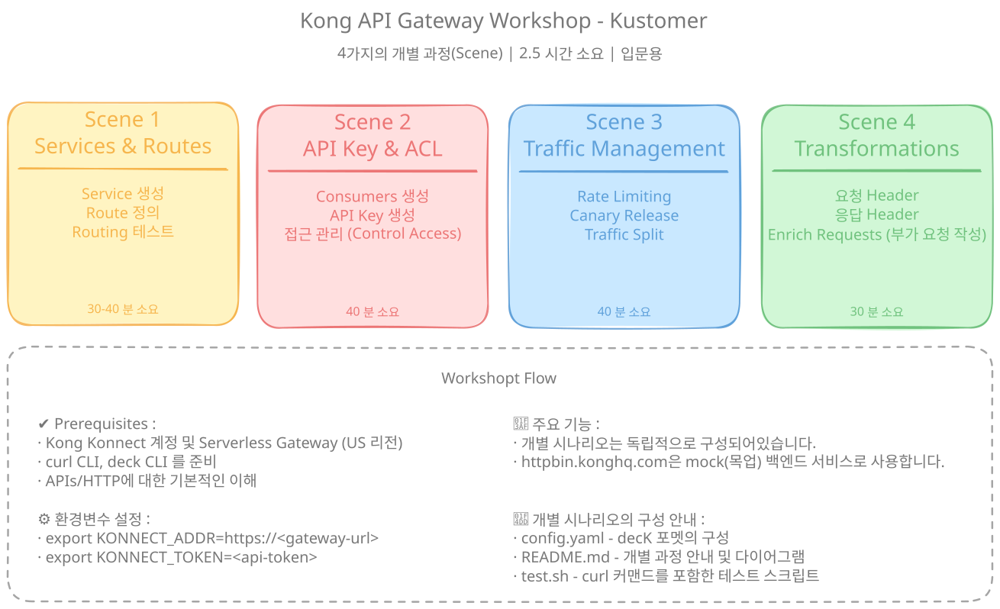

# Kong API Gateway Workshop - For Kustomer

Kong Konnect Serverless Gateway를 활용해 Kong API Gateway의 핵심 use case를 학습하는 hands-on workshop입니다.

- **시간:** 2.5 hours
- **수준:** 입문
- **대상:** 개발자, 플랫폼 엔지니어

---

## Overview

이 workshop은 네 가지 독립적인 실습 시나리오를 통해 Kong API Gateway의 핵심 기능을 다룹니다. 각 scene은 독립적으로 구성되어 있으며, 대규모 API를 운영할 때 실제로 마주치게 되는 use case를 보여줍니다.

### Quick Visual Overview


## Workshop Structure

네 개의 독립 scene으로 구성되어 있으며, setup과 testing을 포함해 각각 약 30~40분 소요됩니다.

1. **Scene 1: Services & Routes** - API Gateway 기본 개념
2. **Scene 2: API Key & ACL** - Consumer Groups와 access control
3. **Scene 3: Traffic Management** - Rate limiting과 canary release
4. **Scene 4: Request Transformations** - Request/Response 수정

---

## Prerequisites

- Kong Konnect account (free tier 사용 가능)
- US region에 배포된 Kong Konnect Serverless Gateway
- `curl` 설치 (API testing용)
- `deck` CLI 설치 ([Installation Guide](https://docs.konghq.com/deck/latest/installation/))
- API와 HTTP에 대한 기본 이해

## Quick Start

### 1. Kong Konnect Setup

1. [Kong Konnect](https://konnect.konghq.com)에 로그인
2. **US region**에 새 Serverless Gateway deployment 생성
  - 우측 상단 혹은 좌측 하단의 리전 확인
  - 좌측 메뉴 > CONNECTIVITY > API Gateway > Gateways
  - `+ New gateway`
  - `Serverless`
  - Gateway name 예시 : <user>-serverless-gw
3. 생성 후 나오는 `Overview` 화면의 Dashboard에서 gateway의 base URL(`Proxy URL`) 확인
4. Environment variable 설정:

   **decK용 (config 배포)** — Konnect API에 연결:
   ```bash
   export DECK_KONNECT_TOKEN=<your-personal-access-token>
   export DECK_KONNECT_ADDR=https://us.api.konghq.com
   export DECK_KONNECT_CONTROL_PLANE_NAME=<user>-serverless-gw

   # 연결 확인
   deck gateway ping
   ```

   **curl/test.sh용** — Proxy URL + Konnect Admin API (자동 조회):
   ```bash
   export KONNECT_TOKEN=<your-personal-access-token>
   export DECK_KONNECT_CONTROL_PLANE_NAME=<user>-serverless-gw
   export KONNECT_API_ADDR=https://us.api.konghq.com

   export KONNECT_CP_ID=${KONNECT_CP_ID:-$(curl -s -G "${KONNECT_API_ADDR}/v2/control-planes" \
     --data-urlencode "filter[name][eq]=${DECK_KONNECT_CONTROL_PLANE_NAME}" \
     -H "Authorization: Bearer $KONNECT_TOKEN" | jq -r '.data[0].id')}

   export KONNECT_GW_PROXY_URL=${KONNECT_GW_PROXY_URL:-$(curl -s "${KONNECT_API_ADDR}/v2/control-planes/${KONNECT_CP_ID}" \
     -H "Authorization: Bearer $KONNECT_TOKEN" | jq -r '
       .config.proxy_urls[0] |
       if (.protocol == "https" and .port == 443) or (.protocol == "http" and .port == 80) then
         "\(.protocol)://\(.host)"
       else
         "\(.protocol)://\(.host):\(.port)"
       end
     ')}
   ```

   `test.sh`는 `DECK_KONNECT_CONTROL_PLANE_NAME`으로 Control Plane ID와 Proxy URL을 자동 조회합니다.
   직접 지정하려면 `KONNECT_CP_ID`, `KONNECT_GW_PROXY_URL`을 설정하면 됩니다.

   > **주의:** `DECK_KONG_ADDR`는 로컬 Kong Gateway Admin API(`http://localhost:8001`)용입니다.
   > Konnect control plane URL을 `DECK_KONG_ADDR`에 넣으면 decK가 Konnect 대신 Gateway 모드로 동작하여 **401** 오류가 발생합니다.
   > Personal access token은 Konnect 우측 상단 메뉴 → **Personal access tokens**에서 생성합니다.

### 2. Run a Scene

각 scene 디렉터리에는 다음이 포함되어 있습니다.
- `config.yaml` - 사전 구성된 Kong configuration (decK format)
- `README.md` - Scene별 안내
- `test.sh` - Testing용 curl commands

**Example:**
```bash
cd scene-1-services-routes
deck sync -s config.yaml
bash test.sh
```

### 3. Using decK for Configuration

decK는 Kong의 declarative configuration tool입니다 (v1.40+):

```bash
# 구성을 배포
deck gateway sync config.yaml

# 구성 배포 전 비교
deck gateway diff config.yaml

# 현재 Gateway의 내용을 덤프하여 저장
deck gateway dump -o kong.yaml

# 구성의 유효성 확인
deck gateway validate config.yaml
```

---

## Scene Breakdown

### Scene 1: Services & Routes
**Goal:** Kong을 통해 API traffic을 생성하고 routing

**What Participants Do:**
- httpbin.konghq.com backend를 가리키는 Service 배포
- `/anything/*` path와 매칭되는 Route 생성
- Kong을 통해 request를 보내고 routing 동작 확인
- Kong Konnect analytics에서 traffic 확인

**Architecture:**
```
Client → Kong Route → Kong Service → httpbin.konghq.com
```

**Backend:** httpbin.konghq.com (mock service)

---

### Scene 2: API Key & ACL
**Goal:** Credentials와 Consumer Groups를 사용한 API 보안

**What Participants Do:**
- 두 Consumer 생성: `mobile-app` (premium), `web-app` (basic)
- 각 consumer에 API Key credentials 생성
- Consumer를 Consumer Groups에 할당
- ACL plugin을 설정하여 premium group만 허용
- Access testing: ✓ Premium allowed, ✗ Basic denied

**Architecture:**
```
Request + API Key → Kong Auth → ACL Check → 
  ✓ Premium Group → Allowed
  ✗ Basic Group → Forbidden
```

**Key Concepts:** Consumer Groups, Credentials, ACL Plugin

---

### Scene 3: Traffic Management
**Goal:** Traffic flow 제어 및 gradual rollout

**What Participants Do:**
- Rate limiting 배포: consumer당 10 requests/minute
- Canary release를 위한 두 Service 구성 (v1 stable, v2 new)
- Rate limiting testing: 12 requests 전송 (처음 10개 통과, 11~12번째는 429)
- Canary traffic split 확인: v1 약 90%, v2 약 10%
- Response의 rate limit headers 확인

**Architecture:**
```
Rate Limit Check → Traffic Split → 90% v1 (stable) / 10% v2 (canary)
```

**Plugins:** Rate Limiting, Traffic Control / Weighted Routing

---

### Scene 4: Request Transformations
**Goal:** Request와 response 수정

**What Participants Do:**
- Request Transformer를 배포하여 metadata headers 추가
- Response Transformer를 배포하여 response enrichment
- Request를 보내고 추가된 headers 확인
- httpbin이 transformed request를 echo back하는지 확인
- Kong이 추가한 response headers 확인

**Architecture:**
```
Client Request → Add Headers → Backend → Add Response Headers → Client
```

**Plugins:** Request Transformer, Response Transformer

---

## Analytics

Kong Konnect Serverless Gateway는 dashboard에 built-in analytics를 제공합니다.

- Request volume 및 latency trends
- Error rates 및 status code distribution
- Top consumers 및 routes
- Real-time traffic insights

각 Serverless Gateway instance의 **Analytics** section에서 Konnect dashboard를 통해 analytics를 모니터링할 수 있습니다.

---

## File Structure

```
kong-kustomer-gateway-workshop/
├── README.md                          (English)
├── README_KO.md                       (한국어)
├── DECK_CHEATSHEET.md                 (deck으로 진행하는 진행 요약)
├── scene-1-services-routes/
│   ├── README.md
│   ├── config.yaml
│   └── test.sh
├── scene-2-api-key-acl/
│   ├── README.md
│   ├── config.yaml
│   └── test.sh
├── scene-3-traffic-management/
│   ├── README.md
│   ├── config.yaml
│   └── test.sh
└── scene-4-transformations/
    ├── README.md
    ├── config.yaml
    └── test.sh
```

---

## Tools & Technologies

- **Kong Konnect Serverless Gateway** - API Gateway
- **decK** - Declarative configuration management
- **httpbin.konghq.com** - Testing용 mock service
- **curl** - Testing용 API client

---

## Support

- Kong API Gateway documentation: [Kong Docs](https://docs.konghq.com)
- Kong Konnect Serverless Gateway: [Konnect Docs](https://docs.konghq.com/konnect/latest/)

---

**Customer:** kustomer | **Created:** June 2026
