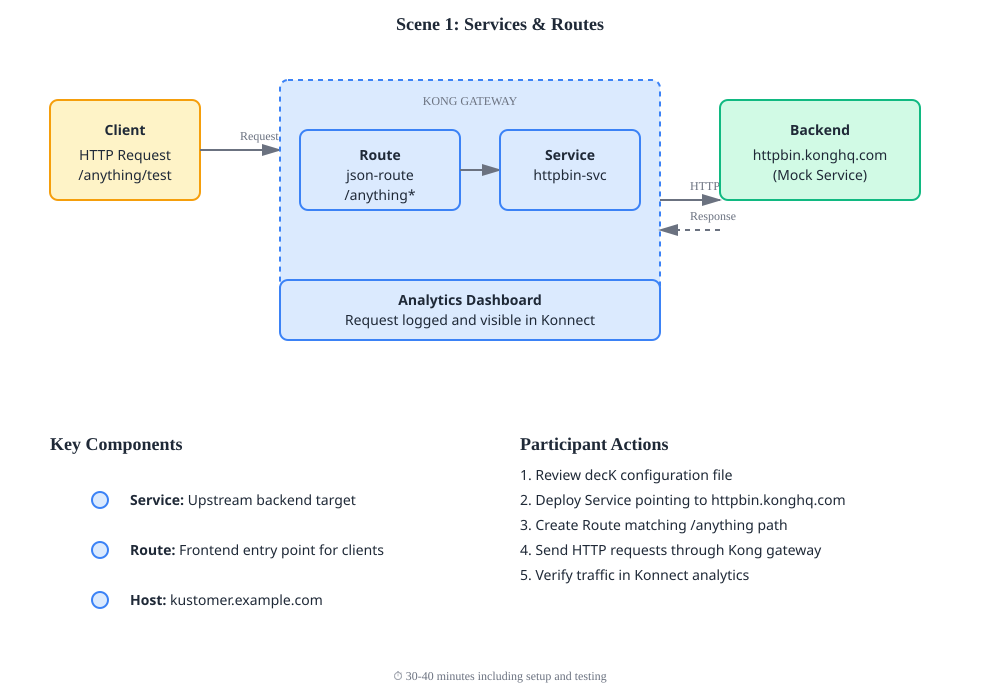

# Scene 1: Services & Routes

Learn Kong's fundamental routing concepts: Services and Routes.

## Architecture Diagram

```
┌─────────────────────────────────────────────────────────────┐
│                        KONG GATEWAY                          │
│                                                               │
│  ┌──────────────┐         ┌─────────────┐                   │
│  │ CLIENT       │         │   ROUTE     │                   │
│  │ REQUEST      │────────→│ /anything   │                   │
│  │ :path/any    │         │ *           │                   │
│  └──────────────┘         └──────┬──────┘                   │
│                                   │                          │
│                            ┌──────▼──────┐                  │
│                            │   SERVICE   │                  │
│                            │ httpbin-svc │                  │
│                            └──────┬──────┘                  │
└─────────────────────────────────────┼──────────────────────┘
                                      │
                                      │ HTTPS
                                      │
                    ┌─────────────────▼──────────────────┐
                    │  BACKEND                            │
                    │  httpbin.konghq.com                │
                    │  (Mock Service)                    │
                    └───────────────────────────────────┘
```

## What You'll Do

In this scene, you'll:
- **Deploy** a Service pointing to a mock backend (httpbin.konghq.com)
- **Create** a Route that accepts traffic on path `/anything`
- **Test** end-to-end traffic flow through Kong to the backend
- **Verify** Kong's analytics captured your requests

### Detailed Context Diagram


## Overview

A **Service** represents your backend API. A **Route** is how clients access that service through Kong. Traffic flows: Client → Route → Service → Backend.

## What You'll Deploy

- **Service:** `httpbin-service` pointing to https://httpbin.konghq.com
- **Route:** `json-route` accepting requests on path `/anything*`
- **Host:** kustomer.example.com

## Quick Start

```bash
# Preview changes before applying
deck gateway diff config.yaml

# Deploy configuration (decK v1.40+)
deck gateway sync config.yaml

# Test the route
bash test.sh
```

## Configuration Details

### Service
```yaml
httpbin-service:
  host: httpbin.konghq.com
  port: 443
  protocol: https
```

### Route
```yaml
json-route:
  paths: ["/anything"]
  strip_path: true
  service: httpbin-service
```

## Testing

**Manual test:**
```bash
curl -X GET "https://<gateway-url>/anything/test" \
  -H "Host: kustomer.example.com"
```

**Expected response:** JSON showing your request details from httpbin

## Key Concepts

- **Service:** Target backend/upstream API
- **Route:** Frontend entry point matching paths/hosts
- **strip_path:** Removes matched path before forwarding to backend
- **Host Header:** Kong matches routes using host headers

## Verification

Check in Kong Konnect dashboard:
1. Services section → See `httpbin-service`
2. Routes section → See `json-route` with path `/anything`
3. Analytics → View incoming requests

---

**Next:** Move to Scene 2 for API authentication with Consumer Groups
