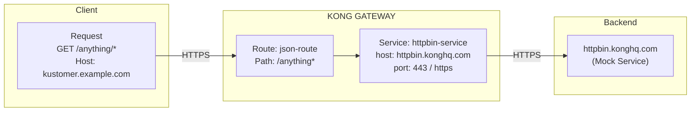

# Scene 1: Services & Routes

Kong의 기본 routing 개념인 Service와 Route를 학습합니다.

## Architecture Diagram

### Diagram



## What You'll Do

이 scene에서 다음을 수행합니다.
- Mock backend(httpbin.konghq.com)를 가리키는 Service **배포**
- Path `/anything`에서 traffic을 받는 Route **생성**
- Kong을 통해 backend까지 end-to-end traffic flow **테스트**
- Kong analytics에 request가 기록되었는지 **확인**

### Detailed Context Diagram


## Overview

**Service**는 backend API를 나타냅니다. **Route**는 client가 Kong을 통해 해당 service에 접근하는 진입점입니다. Traffic flow: Client → Route → Service → Backend.

## What You'll Deploy

- UI에서 다음 항목을 추가해보세요.
  - 좌측 메뉴 > CONNECTIVITY > API Gateway > Gateways > <생성한 Gateway>
  - 상단 탭의 <Gateway services>, <Routes>에 설정합니다.

- **Service:** https://httpbin.konghq.com를 가리키는 `httpbin-service`
- **Route:** Path `/anything*`에서 request를 받는 `json-route`

## Quick Start

```bash
# Preview changes before applying
deck gateway diff config.yaml

# Deploy configuration (decK v1.40+)
deck gateway sync config.yaml

# Test the route
bash test.sh
```

## Configuration Details

### Service
```yaml
httpbin-service:
  host: httpbin.konghq.com
  port: 443
  protocol: https
```

### Route
```yaml
json-route:
  paths: ["/anything"]
  strip_path: true
  service: httpbin-service
```

## Testing

**Manual test:**
```bash
curl -X GET "https://<gateway-url>/anything/test" \
  -H "Host: kustomer.example.com"
```

**Expected response:** httpbin에서 반환하는 request details JSON

## Key Concepts

- **Service:** Target backend/upstream API
- **Route:** Path/host를 매칭하는 frontend entry point
- **strip_path:** Backend로 forwarding하기 전에 matched path 제거
  - 현재 구성에서 `/anything` 을 route 경로로 지정하였는데, 실제 전달시에는 해당 경로를 제거 합니다.
- **Host Header:** Kong은 host header로 route를 매칭

## Verification

Kong Konnect dashboard에서 확인:
1. Services section → `httpbin-service` 확인
2. Routes section → Path `/anything`인 `json-route` 확인
3. Analytics → Incoming requests 확인

---

**Next:** Scene 2로 이동하여 Consumer Groups를 사용한 API authentication 학습
