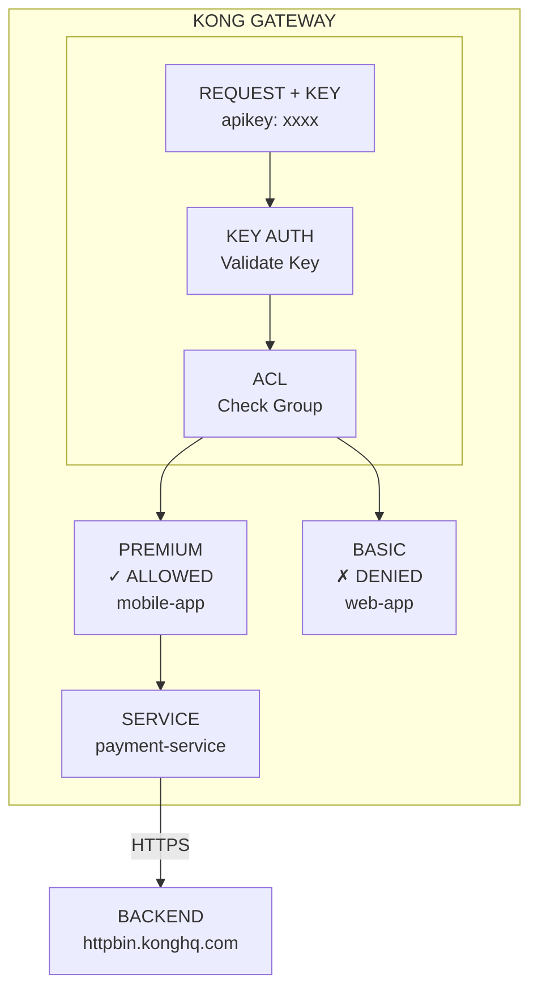
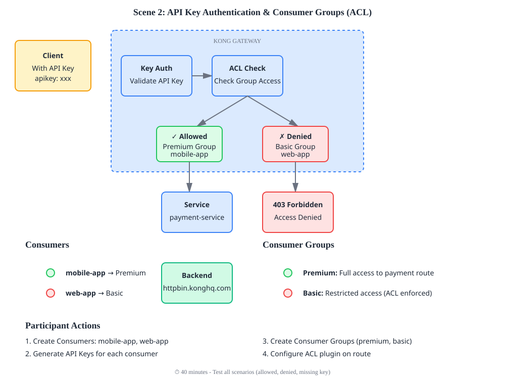

# Scene 2: API Key Authentication & Consumer Groups (ACL)

Credentials와 Consumer Groups를 사용한 access control로 API를 보호합니다.

## Architecture Diagram

### Diagram



## What You'll Do

이 scene에서 다음을 수행합니다.
- 두 Consumer **생성**: `mobile-app` (premium), `web-app` (basic)
- 각 consumer에 고유 API Key **생성**
- Consumer를 Consumer Groups(premium/basic)에 **할당**
- ACL plugin을 설정하여 payment route를 premium group만 허용하도록 **구성**
- Access control **테스트**: ✓ Premium allowed, ✗ Basic denied

### Detailed Context Diagram


## Overview

다음을 통해 API security를 구현합니다.
- **Consumers:** API user/app을 나타냄 (mobile-app, web-app)
- **API Keys:** 각 consumer의 simple credentials
- **Consumer Groups:** Access control을 위한 consumer 그룹화
- **ACL Plugin:** 특정 group만 route 접근 허용

## What You'll Deploy

- **Service:** `payment-service` (httpbin `/anything` mock backend)
- **Route:** API Key authentication이 적용된 `payment-route`
- **Consumers:** `mobile-app` (premium), `web-app` (basic)
- **Consumer Groups:** `premium`, `basic`
- **ACL Plugin:** payment route를 `premium` group만 허용

`config.yaml`을 참고하여 UI에서 `Service`, `Route`, `Consumers`, `Consumer Groups`, `ACL Plugin`을 추가해보세요.
- `Service` 등록시에는 `Protocol, host, port, and path` 항목을 사용해보세요.
- `Consumers`를 등록할때는 만든 Control Plane 인 Gateway의 탭에서 `Consumers`를 선택하여 진행 하세요.
- `Consumers` 생성 후 생성한 Consumers의 `Credentials` 탭에서 `Key Authentication`을 추가할 수 있습니다.
- Control Plane (Gateway)에서 ACL 플러그인을 추가해보세요. 허용되는 항목은 리스트로 나타나지 않으므로, 허용할 그룹 이름을 타이핑하여 넣어야 합니다.
- 구성이 완료되면 `deck gateway diff ./config.yaml` 를 실행하여 구성을 비교해보세요.

## Access Control Matrix

| Consumer | Group | Can access /payments? |
|----------|-------|----------------------|
| mobile-app | premium | ✓ Yes |
| web-app | basic | ✗ No |

## Quick Start

```bash
# Deploy configuration (decK v1.40+)
deck gateway sync config.yaml

# Get API keys and test access
bash test.sh
```

## Configuration Details

### Consumers & API Keys
```yaml
consumers:
  - username: mobile-app
    keyauth_credentials:
      - key: mobile-key-12345
    groups:
      - premium
      
  - username: web-app
    keyauth_credentials:
      - key: web-key-67890
    groups:
      - basic
```

### ACL Plugin (restricts to premium group)
```yaml
plugins:
  - name: acl
    config:
      include_consumer_groups: true
      allow:
        - premium
```

## Testing

> **주의:** Proxy URL(`/payments` traffic)과 Admin API(`/core-entities`)는 URL이 다릅니다.

**Environment setup (Control Plane ID + Proxy URL 자동 조회):**
```bash
export KONNECT_API_ADDR=https://us.api.konghq.com
export KONNECT_TOKEN=<your-personal-access-token>
export DECK_KONNECT_CONTROL_PLANE_NAME=<user>-serverless-gw

# Control Plane ID 자동 조회
export KONNECT_CP_ID=${KONNECT_CP_ID:-$(curl -s -G "${KONNECT_API_ADDR}/v2/control-planes" \
  --data-urlencode "filter[name][eq]=${DECK_KONNECT_CONTROL_PLANE_NAME}" \
  -H "Authorization: Bearer $KONNECT_TOKEN" | jq -r '.data[0].id')}

export KONNECT_ADMIN_ADDR="${KONNECT_API_ADDR}/v2/control-planes/${KONNECT_CP_ID}/core-entities"

# Proxy URL 자동 조회 (Dashboard의 Proxy URL과 동일)
export KONNECT_GW_PROXY_URL=${KONNECT_GW_PROXY_URL:-$(curl -s "${KONNECT_API_ADDR}/v2/control-planes/${KONNECT_CP_ID}" \
  -H "Authorization: Bearer $KONNECT_TOKEN" | jq -r '
    .config.proxy_urls[0] |
    if (.protocol == "https" and .port == 443) or (.protocol == "http" and .port == 80) then
      "\(.protocol)://\(.host)"
    else
      "\(.protocol)://\(.host):\(.port)"
    end
  ')}
```

**Path mapping:** `GET /payments/status` → httpbin `GET /anything/status`

**Get API key (Konnect Admin API):**
```bash
# 1) username → consumer UUID 조회 (Konnect API는 username을 path에 직접 사용 불가)
CONSUMER_ID=$(curl -s -X GET "${KONNECT_ADMIN_ADDR}/consumers" \
  -H "Authorization: Bearer $KONNECT_TOKEN" \
  | jq -r '.data[] | select(.username=="mobile-app") | .id')

# 2) UUID로 key-auth 조회
curl -s -X GET "${KONNECT_ADMIN_ADDR}/consumers/${CONSUMER_ID}/key-auth" \
  -H "Authorization: Bearer $KONNECT_TOKEN" | jq '.data[0].key'
```

> Konnect core-entities API에서 `/consumers/mobile-app/key-auth`처럼 username을 쓰면
> `consumer_id 'mobile-app' is not a UUID` 오류가 발생합니다.

**Test with valid key (premium) — Proxy URL:**
```bash
curl -s -X GET "$KONNECT_GW_PROXY_URL/payments/status" \
  -H "apikey: mobile-key-12345"
# Expected: 200 OK
```

**Test with basic key (should fail) — Proxy URL:**
```bash
curl -s -X GET "$KONNECT_GW_PROXY_URL/payments/status" \
  -H "apikey: web-key-67890"
# Expected: 403 Forbidden
```

**Test without key (should fail) — Proxy URL:**
```bash
curl -s -X GET "$KONNECT_GW_PROXY_URL/payments/status"
# Expected: 401 Unauthorized
```

## Key Concepts

- **Consumer:** API를 사용하는 end-user, application, 또는 service
- **API Key (key-auth):** Key value로 구성된 simple credential
- **Consumer Group:** ACL bulk management를 위한 consumer 그룹
- **ACL Plugin:** Consumer group membership에 따라 route allow/deny
- **Credentials:** Consumer에 저장되며, 각 request마다 매칭

## Real-World Use Cases

1. **Mobile App vs Web App:** Rate limit 또는 feature 차등 적용
2. **Partner Access:** External developer를 별도 group으로 분리
3. **Internal Tools:** Full access를 가진 별도 group
4. **Feature Flags:** Consumer group별 route access 제어

## Verification

Kong Konnect dashboard에서 확인:
1. Consumers section → `mobile-app`, `web-app` 확인
2. Consumer Groups section → `premium`, `basic` 확인
3. Routes section → API Key plugin이 적용된 `payment-route` 확인
4. Analytics → Authenticated requests 확인

---

**Next:** Scene 3으로 이동하여 traffic management와 rate limiting 학습
