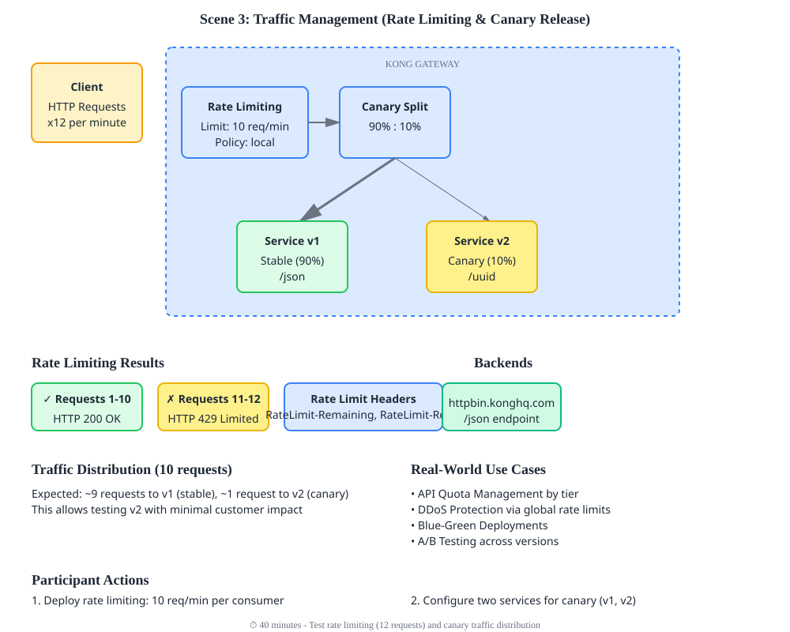

# Scene 3: Traffic Management - Rate Limiting & Canary Release

Control API traffic flow and enable safe rollouts with gradual traffic migration.

## Architecture Diagram

```
┌──────────────────────────────────────────────────────────────┐
│                    KONG GATEWAY                               │
│                                                                │
│  RATE LIMITING CHECK        CANARY TRAFFIC SPLIT             │
│  ┌──────────────────┐       ┌───────────────────┐            │
│  │ Request Counter  │       │   Route Traffic   │            │
│  │ 10 req/min limit │──────→│   90% : 10%       │            │
│  └──────────────────┘       └────────┬──────────┘            │
│                                       │                       │
│                        ┌──────────────┼──────────────┐        │
│                        │              │              │        │
│                   ┌────▼────┐    ┌───▼─────┐       │        │
│                   │  v1      │    │  v2     │       │        │
│                   │ 90%      │    │ 10%     │       │        │
│                   │ STABLE   │    │ CANARY  │       │        │
│                   └────┬─────┘    └───┬─────┘       │        │
│                        │              │             │        │
│                        └──────────────┼──────────────┘        │
│                                       │                       │
│  ✓ Requests 1-10: PASS               │                       │
│  ✗ Requests 11+: 429 RATE LIMITED    │                       │
└──────────────────────────────────────┼────────────────────────┘
                                       │ HTTPS
                    ┌──────────────────┴──────────────────┐
                    │                                     │
        ┌───────────▼────────┐          ┌────────────────▼───┐
        │ httpbin.konghq.com │          │ httpbin.konghq.com │
        │ /json (v1)         │          │ /uuid (v2)         │
        └────────────────────┘          └────────────────────┘
```

## What You'll Do

In this scene, you'll:
- **Deploy** rate limiting: Enforce 10 requests/minute per consumer
- **Configure** two services for canary release (v1 and v2)
- **Test** rate limiting: Send 12 requests, observe first 10 succeed and 11-12 fail with 429
- **Verify** canary traffic distribution: ~90% to v1, ~10% to v2
- **Monitor** rate limit headers showing remaining quota

### Detailed Context Diagram


## Overview

Master two essential traffic management patterns:
- **Rate Limiting:** Enforce request quotas to prevent abuse
- **Canary Release:** Route percentage of traffic to new service version for safe rollouts

## What You'll Deploy

- **Services:** `payment-api-v1`, `payment-api-v2`
- **Route:** `api-route` with traffic split between v1 and v2
- **Rate Limiting:** 10 requests per minute per consumer
- **Canary:** 90% traffic to v1, 10% to v2 (new version)

## Rate Limiting

Prevents API abuse by enforcing quotas:
- **Limit:** 10 requests per minute per consumer
- **Window:** Rolling 60-second window
- **Response:** 429 (Too Many Requests) when exceeded

### Rate Limit Headers

Successful requests include rate limit info:
```
RateLimit-Limit: 10
RateLimit-Remaining: 9
RateLimit-Reset: 1623456789
```

## Canary Release Pattern

Safely roll out new API versions:

```
Incoming traffic
       ↓
   Route
   /     \
  90%     10%
   |      |
  v1     v2 (new)
```

Gradually increase v2 percentage as confidence builds.

## Quick Start

```bash
# Deploy configuration (decK v1.40+)
deck gateway sync config.yaml

# Test rate limiting and canary
bash test.sh
```

## Configuration Details

### Rate Limiting Plugin
```yaml
plugins:
  - name: rate-limiting
    config:
      minute: 10
      policy: local
      limit_by: consumer
```

### Canary Release (Load Balancing)
```yaml
services:
  - name: payment-api-v1
    host: httpbin.konghq.com
    port: 443
  
  - name: payment-api-v2
    host: httpbin.konghq.com
    port: 443

routes:
  - name: api-route
    service: payment-api-v1
    # 10% traffic goes to v2 via weighted round-robin
    # Requires Consumer for this demo
```

## Testing

**Test rate limiting:**
```bash
# Send 12 requests (limit is 10/min)
for i in {1..12}; do
  curl -s -X GET "https://<gateway-url>/api/status" \
    -H "Host: kaokaopay.example.com" \
    -w "HTTP %{http_code}\n"
  sleep 1
done
```

Expected: First 10 succeed (200), requests 11-12 fail (429)

**Check rate limit headers:**
```bash
curl -i -X GET "https://<gateway-url>/api/status" \
  -H "Host: kaokaopay.example.com"
```

Look for `RateLimit-*` headers

**Test canary traffic distribution:**
```bash
for i in {1..10}; do
  curl -s -X GET "https://<gateway-url>/api/version" \
    -H "Host: kaokaopay.example.com" | grep version
done
```

Expected: ~9 responses from v1, ~1 from v2

## Key Concepts

- **Rate Limiting Policy:** Method of identifying consumers (local, redis, etc.)
- **Limit Window:** Time period for quota (minute, hour, day)
- **Canary Deployment:** Percentage-based traffic split for gradual rollout
- **Load Balancing:** Weighted distribution across service instances/versions
- **Graceful Degradation:** 429 response indicates rate limit exceeded

## Real-World Use Cases

1. **API Quota Management:** Different rate limits per pricing tier
2. **DDoS Protection:** Global rate limiting blocks excessive traffic
3. **Version Rollout:** Canary 10% of traffic to v2, increase to 50%, then 100%
4. **Blue-Green Deployment:** 0% to new version, then 100% after validation
5. **A/B Testing:** Route users to different versions for comparison

## Monitoring

Check Kong Konnect dashboard:
1. Analytics section → Request volume trends
2. Status code distribution → See 429s when limit exceeded
3. Error rates → Monitor canary for v2 issues
4. Latency trends → Ensure v2 performance matches v1

---

**Next:** Move to Scene 4 for request transformations
