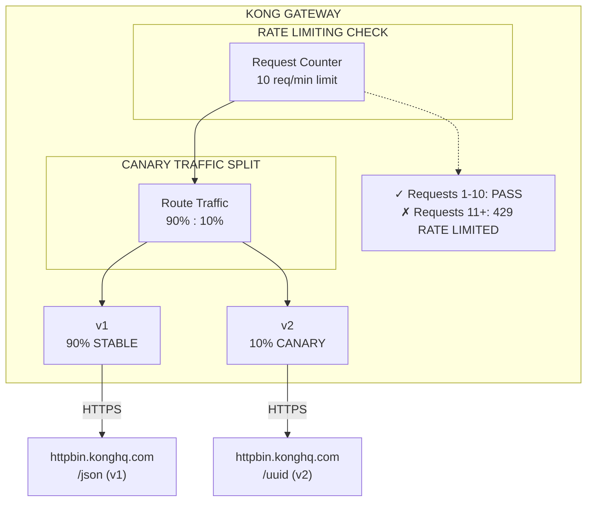

# Scene 3: Traffic Management - Rate Limiting & Canary Release

API traffic flow를 제어하고 gradual traffic migration으로 safe rollout을 수행합니다.

## Architecture Diagram

### Diagram



## What You'll Do

이 scene에서 다음을 수행합니다.
- Rate limiting **배포**: consumer당 10 requests/minute 적용
- Canary release를 위한 두 Service **구성** (v1, v2)
- Rate limiting **테스트**: 12 requests 전송, 처음 10개 성공·11~12번째 429 확인
- Canary traffic distribution **검증**: v1 약 90%, v2 약 10%
- Remaining quota를 보여주는 rate limit headers **모니터링**

### Detailed Context Diagram


## Overview

두 가지 핵심 traffic management pattern을 다룹니다.
- **Rate Limiting:** Request quota를 적용하여 abuse 방지
- **Canary Release:** Traffic의 일부를 new service version으로 routing하여 safe rollout

## What You'll Deploy

- **Services:** `payment-api-v1`, `payment-api-v2`
- **Route:** v1/v2 traffic split이 적용된 `api-route`
- **Rate Limiting:** consumer당 10 requests/minute
- **Canary:** v1 90%, v2 10% (new version)

## Rate Limiting

Request quota를 적용하여 API abuse를 방지합니다.
- **Limit:** consumer당 10 requests/minute
- **Window:** Rolling 60-second window
- **Response:** 초과 시 429 (Too Many Requests)

### Rate Limit Headers

성공한 request에는 rate limit 정보가 포함됩니다.

```
RateLimit-Limit: 10
RateLimit-Remaining: 9
RateLimit-Reset: 1623456789
```

## Canary Release Pattern

New API version을 안전하게 rollout합니다.

```
Incoming traffic
       ↓
   Route
   /     \
  90%     10%
   |      |
  v1     v2 (new)
```

Confidence가 쌓이면 v2 비율을 점진적으로 높입니다.

## Quick Start

```bash
# Deploy configuration (decK v1.40+)
deck gateway sync config.yaml

# Test rate limiting and canary
bash test.sh
```

## Configuration Details

### Rate Limiting Plugin
```yaml
plugins:
  - name: rate-limiting
    config:
      minute: 10
      policy: local
      limit_by: consumer
```

### Canary Release (Load Balancing)
```yaml
services:
  - name: payment-api-v1
    host: httpbin.konghq.com
    port: 443
  
  - name: payment-api-v2
    host: httpbin.konghq.com
    port: 443

routes:
  - name: api-route
    service: payment-api-v1
    # weighted round-robin으로 10% traffic이 v2로 전달
    # 이 demo에는 Consumer 설정 필요
```

## Testing

**Automated test (`test.sh`):**
```bash
export KONNECT_TOKEN=<pat>
export DECK_KONNECT_CONTROL_PLANE_NAME=<user>-serverless-gw
export KONNECT_ADDR=https://<gateway-proxy-url>
bash test.sh
```

`test.sh`는 canary(50회)를 먼저 실행한 뒤 rate limit을 검증합니다. `config.yaml`의 `minute: 60`이면 한 번에 통과합니다.

**Test rate limiting (수동):**
```bash
# limit은 config.yaml minute 값 (기본 60/min)
for i in {1..65}; do
  curl -s -X GET "https://<gateway-proxy-url>/api" \
    -H "Host: kustomer.example.com" \
    -w "HTTP %{http_code}\n"
  sleep 0.5
done
```

Expected: 처음 60건 200, 이후 429

**Check rate limit headers:**
```bash
curl -i -X GET "https://<gateway-proxy-url>/api" \
  -H "Host: kustomer.example.com"
```

`RateLimit-*` headers 확인

**Test canary traffic distribution:**

> rate limit이 켜져 있으면 `minute >= 50` 이어야 합니다. quota가 부족하면 429(`API rate limit exceeded`)만 반환되어 v1/v2 구분이 불가합니다.

```bash
# service path는 /headers (upstream Host로 v1/v2 구분)
for i in {1..50}; do
  curl -s "https://<gateway-proxy-url>/api" \
    -H "Host: kustomer.example.com" | grep -o '"Host": "[^"]*"'
done
```

Expected: `httpbin.konghq.com`(v1) ~90%, `httpbin.org`(v2) ~10%

> Hostname target는 DNS A record 개수만큼 balancer slot이 생깁니다. `httpbin.org`는 8개 IP로 풀리므로 weight `10`이면 실질 비율은 약 50/50(90 vs 8×10)입니다. `config.yaml`은 v2 weight `1`로 보정합니다(90 vs 8×1 ≈ 91/9).

## Key Concepts

- **Rate Limiting Policy:** Consumer 식별 방식 (local, redis 등)
- **Limit Window:** Quota time period (minute, hour, day)
- **Canary Deployment:** Gradual rollout을 위한 percentage-based traffic split
- **Load Balancing:** Service instance/version 간 weighted distribution
- **Graceful Degradation:** Rate limit 초과 시 429 response

## Real-World Use Cases

1. **API Quota Management:** Pricing tier별 rate limit 차등 적용
2. **DDoS Protection:** Global rate limiting으로 과도한 traffic 차단
3. **Version Rollout:** v2에 10% canary → 50% → 100%로 점진적 증가
4. **Blue-Green Deployment:** Validation 후 0% → 100% 전환
5. **A/B Testing:** User group별 다른 version routing

## Monitoring

Kong Konnect dashboard에서 확인:
1. Analytics section → Request volume trends
2. Status code distribution → Limit 초과 시 429 확인
3. Error rates → v2 canary issue 모니터링
4. Latency trends → v2 performance가 v1과 유사한지 확인

---

**Next:** Scene 4로 이동하여 request transformations 학습
