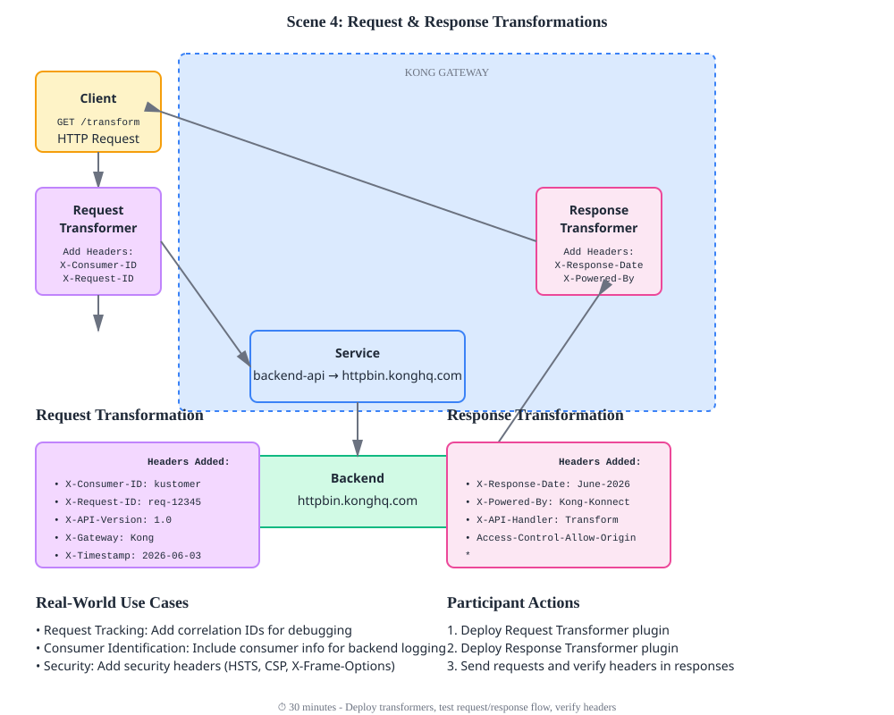

# Scene 4: Request & Response Transformations

Modify API requests and responses in transit using transformation plugins.

## Architecture Diagram

```
CLIENT REQUEST
     │
     │  Original Headers:
     │  Host: kaokaopay.example.com
     │
     ▼
┌─────────────────────────────────────────────────────────┐
│            REQUEST TRANSFORMER PLUGIN                    │
│  • Add X-Consumer-ID: kaokaopay-user                    │
│  • Add X-Request-ID: req-12345                          │
│  • Add X-API-Version: 1.0                               │
│  • Add X-Gateway: Kong                                  │
└──────────────────────┬──────────────────────────────────┘
                       │
                       ▼ Enhanced Request
         ┌─────────────────────────────┐
         │  BACKEND SERVICE            │
         │  httpbin.konghq.com         │
         │  (Receives enhanced request)│
         └──────────────┬──────────────┘
                        │
                        ▼ Backend Response
┌─────────────────────────────────────────────────────────┐
│           RESPONSE TRANSFORMER PLUGIN                    │
│  • Add X-Response-Date: June-2026                       │
│  • Add X-Powered-By: Kong-Konnect                       │
│  • Add Access-Control-Allow-Origin: *                   │
└──────────────────────┬──────────────────────────────────┘
                       │
                       ▼ Enhanced Response
                  CLIENT RECEIVES
              Complete transformed
            request and response flow
```

## What You'll Do

In this scene, you'll:
- **Deploy** Request Transformer plugin to add metadata headers
- **Deploy** Response Transformer plugin to enrich responses
- **Test** end-to-end transformation: Send request, observe added headers
- **Verify** both request and response transformations in action
- **Inspect** httpbin's echo to see what Kong added to your request

### Detailed Context Diagram


## Overview

Transform requests and responses to:
- Add/remove headers
- Add request/response metadata
- Add tracking and correlation IDs
- Enrich requests with Kong/consumer information
- Add custom security headers

## What You'll Deploy

- **Service:** `backend-api`
- **Route:** `transform-route`
- **Request Transformer Plugin:** Add headers with request metadata
- **Response Transformer Plugin:** Add custom response headers

## Transformation Flow

```
Client Request
     ↓
Request Transformer Plugin
  (Add X-Consumer-ID, X-Request-ID, X-API-Version)
     ↓
Kong Service
     ↓
Backend Response
     ↓
Response Transformer Plugin
  (Add X-Response-Date, X-Powered-By)
     ↓
Client Response
```

## Quick Start

```bash
# Deploy configuration (decK v1.40+)
deck gateway sync config.yaml

# Test request/response transformation
bash test.sh
```

## Configuration Details

### Request Transformer
```yaml
plugins:
  - name: request-transformer
    config:
      add:
        headers:
          - X-Consumer-ID:$consumer_id
          - X-Request-ID:$request_id
          - X-API-Version:1.0
```

**Variables:**
- `$consumer_id` - Kong consumer ID (if authenticated)
- `$request_id` - Unique request ID
- `$api_version` - Custom value

### Response Transformer
```yaml
plugins:
  - name: response-transformer
    config:
      add:
        headers:
          - X-Response-Date:$(date)
          - X-Powered-By:Kong
```

## Testing

**Test request transformation:**
```bash
curl -i -X GET "https://<gateway-url>/transform/data" \
  -H "Host: kaokaopay.example.com"
```

Look for added headers in the response from your backend showing what Kong added:
- `X-Consumer-ID`
- `X-Request-ID`
- `X-API-Version`

**Test response transformation:**
```bash
curl -v -X GET "https://<gateway-url>/transform/data" \
  -H "Host: kaokaopay.example.com" 2>&1 | grep -i "x-"
```

Look for response headers added by Kong:
- `X-Response-Date`
- `X-Powered-By`

## Key Concepts

- **Request Transformer:** Modifies incoming requests before sending to backend
- **Response Transformer:** Modifies backend responses before sending to client
- **Header Variables:** Kong provides variables like `$consumer_id`, `$request_id`
- **Use Cases:** Tracking, security headers, versioning, correlation IDs

## Common Transformations

### Add Tracking Headers
```yaml
add:
  headers:
    - X-Request-ID:$request_id
    - X-Trace-ID:$consumer_id
```

### Add Security Headers
```yaml
add:
  headers:
    - X-Frame-Options:DENY
    - X-Content-Type-Options:nosniff
```

### Add API Versioning
```yaml
add:
  headers:
    - X-API-Version:v2
    - X-API-Gateway:Kong
```

### Remove Sensitive Headers
```yaml
remove:
  headers:
    - Authorization
    - X-Internal-Secret
```

## Real-World Use Cases

1. **Request Tracking:** Add correlation IDs for debugging
2. **Consumer Identification:** Include consumer info for backend logging
3. **API Versioning:** Signal which API version is being called
4. **Security:** Add security headers (HSTS, CSP, etc.)
5. **Request Enrichment:** Add metadata from Kong context
6. **Legacy System Integration:** Add headers required by old backends

## Monitoring

Check Kong Konnect dashboard:
1. Analytics section → Request volume
2. Logs → View transformed headers in request details
3. Performance → Monitor transformation overhead

---

**Congratulations!** You've completed all four core use cases.

### What's Next?

- **Combine:** Create a single config with all 4 scenes
- **Explore:** Try OAuth2, JWT, or other authentication plugins
- **Scale:** Deploy Kong in high-availability configuration
- **Monitor:** Add detailed logging and monitoring
- **Extend:** Build custom plugins for specific needs
