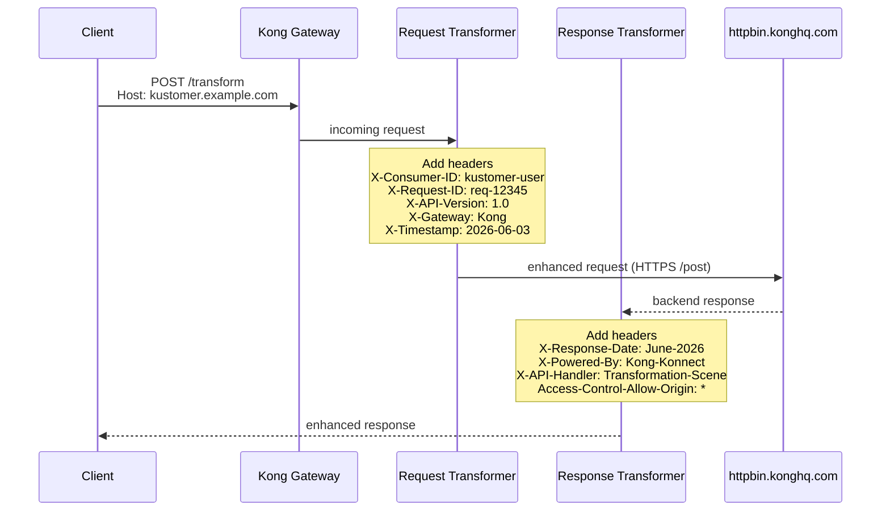

# Scene 4: Request & Response Transformations

Transformation plugin으로 API request와 response를 transit 중에 수정합니다.

## Architecture Diagram

### Sequence Diagram



## What You'll Do

이 scene에서 다음을 수행합니다.
- Request Transformer plugin **배포**: metadata header 추가
- Response Transformer plugin **배포**: response enrichment
- End-to-end transformation **테스트**: request 전송 후 추가된 header 확인
- Request/response transformation이 동작하는지 **검증**
- httpbin echo로 Kong이 request에 추가한 header **확인**

### Detailed Context Diagram


## Overview

Request와 response를 변환하여 다음을 수행합니다.
- Header 추가/제거
- Request/response metadata 추가
- Tracking 및 correlation ID 추가
- Kong/consumer 정보로 request enrichment
- Custom security header 추가

## What You'll Deploy

- **Service:** `backend-api`
- **Route:** `transform-route`
- **Request Transformer Plugin:** request metadata header 추가
- **Response Transformer Plugin:** custom response header 추가

## Transformation Flow

```
Client Request
     ↓
Request Transformer Plugin
  (X-Consumer-ID, X-Request-ID, X-API-Version 등 추가)
     ↓
Kong Service → Backend
     ↓
Backend Response
     ↓
Response Transformer Plugin
  (X-Response-Date, X-Powered-By 등 추가)
     ↓
Client Response
```

## Quick Start

```bash
# Deploy configuration (decK v1.40+)
deck gateway sync config.yaml

# Test request/response transformation
bash test.sh
```

## Configuration Details

### Request Transformer
```yaml
plugins:
  - name: request-transformer
    config:
      add:
        headers:
          - X-Consumer-ID:kustomer-user
          - X-Request-ID:req-12345
          - X-API-Version:"1.0"
          - X-Gateway:Kong
          - X-Timestamp:2026-06-03
```

**Variables (동적 값 예시):**
- `$consumer_id` — Kong consumer ID (인증된 경우)
- `$request_id` — 고유 request ID
- `$api_version` — custom 값

> 이 workshop config는 고정값을 사용합니다. Consumer 인증과 연동할 때는 `$consumer_id` 같은 Kong 변수를 활용할 수 있습니다.

### Response Transformer
```yaml
plugins:
  - name: response-transformer
    config:
      add:
        headers:
          - X-Response-Date:"June-2026"
          - X-Powered-By:Kong-Konnect
          - X-API-Handler:Transformation-Scene
          - Access-Control-Allow-Origin:"*"
```

## Testing

**Automated test (`test.sh`):**
```bash
export KONNECT_TOKEN=<pat>
export DECK_KONNECT_CONTROL_PLANE_NAME=<user>-serverless-gw
export KONNECT_ADDR=https://<gateway-proxy-url>
bash test.sh
```

**Path 참고:** Route path는 `/transform`, `strip_path: true`, Service path는 `/post`입니다.
- `POST /transform` → upstream `https://httpbin.konghq.com/post` (httpbin echo, **200**)
- `POST /transform/data` → upstream `/post/data` → httpbin에 없음 (**404**)

**Test request transformation (httpbin echo):**
```bash
curl -s -X POST "https://<gateway-proxy-url>/transform" \
  -H "Host: kustomer.example.com" \
  -H "Content-Type: application/json" \
  -d '{"message": "test"}' | grep -iE 'X-Consumer|X-Api-Version|X-Gateway|X-Timestamp'
```

또는 header만 보기:
```bash
curl -s -X POST "https://<gateway-proxy-url>/transform" \
  -H "Host: kustomer.example.com" \
  -H "Content-Type: application/json" \
  -d '{"message": "test"}' | jq '.headers | with_entries(select(.key | test("^[Xx]-")))'
```

Backend(httpbin)가 echo한 request header에서 Kong Request Transformer가 추가한 항목을 확인합니다. (httpbin JSON에서는 header 이름이 `X-Consumer-Id`처럼 소문자로 표시될 수 있습니다.)
- `X-Consumer-ID` → `kustomer-user`
- `X-API-Version` → `"1.0"`
- `X-Gateway` → `Kong`
- `X-Timestamp` → `2026-06-03`
- `X-Request-ID` → `req-12345` (config에 정의; echo에 없으면 `deck gateway sync` 후 재확인)

**Test response transformation:**

> Request Transformer 결과는 **response body**(httpbin JSON의 `headers`)에 보입니다.  
> Response Transformer 결과는 **HTTP response header**에만 추가되므로 `curl -s`로는 보이지 않습니다. `-i` 또는 `-D -`를 사용하세요.

```bash
curl -i -X POST "https://<gateway-proxy-url>/transform" \
  -H "Host: kustomer.example.com" \
  -H "Content-Type: application/json" \
  -d '{}' 2>&1 | grep -iE '^(HTTP/|x-|access-control)'
```

header만 분리해서 보기:
```bash
curl -s -D - -o /dev/null -X POST "https://<gateway-proxy-url>/transform" \
  -H "Host: kustomer.example.com" \
  -H "Content-Type: application/json" \
  -d '{}'
```

Kong Response Transformer가 **client로 돌아오는 HTTP response**에 추가한 header:
- `X-Response-Date`
- `X-Powered-By`
- `X-API-Handler`
- `Access-Control-Allow-Origin`

## Key Concepts

- **Request Transformer:** Backend로 보내기 전 incoming request 수정
- **Response Transformer:** Client로 보내기 전 backend response 수정
- **Header Variables:** Kong이 `$consumer_id`, `$request_id` 등 변수 제공
- **Use Cases:** Tracking, security header, versioning, correlation ID

## Common Transformations

### Add Tracking Headers
```yaml
add:
  headers:
    - X-Request-ID:$request_id
    - X-Trace-ID:$consumer_id
```

### Add Security Headers
```yaml
add:
  headers:
    - X-Frame-Options:DENY
    - X-Content-Type-Options:nosniff
```

### Add API Versioning
```yaml
add:
  headers:
    - X-API-Version:v2
    - X-API-Gateway:Kong
```

### Remove Sensitive Headers
```yaml
remove:
  headers:
    - Authorization
    - X-Internal-Secret
```

## Real-World Use Cases

1. **Request Tracking:** Debugging을 위한 correlation ID 추가
2. **Consumer Identification:** Backend logging용 consumer 정보 포함
3. **API Versioning:** 호출 중인 API version 신호 전달
4. **Security:** Security header 추가 (HSTS, CSP 등)
5. **Request Enrichment:** Kong context의 metadata 추가
6. **Legacy System Integration:** 구형 backend가 요구하는 header 추가

## Monitoring

Kong Konnect dashboard에서 확인:
1. Analytics section → Request volume
2. Logs → Request detail에서 transformed header 확인
3. Performance → Transformation overhead 모니터링

---

**축하합니다!** 네 가지 core use case를 모두 완료했습니다.

### What's Next?

- **Combine:** 4개 scene을 하나의 config로 통합
- **Explore:** OAuth2, JWT 등 다른 authentication plugin 시도
- **Scale:** High-availability 구성으로 Kong 배포
- **Monitor:** 상세 logging 및 monitoring 추가
- **Extend:** 특정 요구사항용 custom plugin 개발
